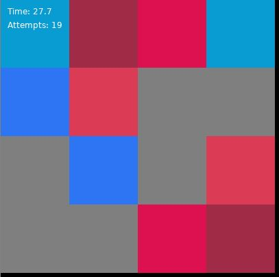

# Memory Game - README

## Overview
This is a simple Memory Game built using the LÖVE 2D framework. The objective of the game is to match pairs of cards with the same color. The game tracks the number of attempts made and the time taken to complete the game.

## How to Play
1. **Start the Game**:  
   When you launch the game, you'll see a "Memory Game" title and a prompt to click to start. Click anywhere on the screen to begin the game.

2. **Gameplay**:  
   - The game board consists of a 4x4 grid of cards. Each card hides a color.
   - Click on a card to reveal its color.
   - Click on a second card to try and find a match.
   - If the two selected cards have the same color, they will remain revealed, and a match is counted.
   - If the cards do not match, they will be flipped back over after a short time.
   - The game continues until all pairs of matching cards have been found.

3. **End of Game**:  
   When all pairs have been successfully matched, the game will display a "You win!" message along with the total time taken and the number of attempts made.

## Controls
- **Left Mouse Button**:  
  - In the "Start" state: Click to begin the game.
  - In the "Play" state: Click on cards to reveal their color.

## Installation
1. Download and install the LÖVE 2D framework from [love2d.org](https://love2d.org/).
2. Save the game code into a `.lua` file.
3. Run the game by dragging the `.lua` file onto the LÖVE application or by executing `love .` in the terminal from the directory containing the file.

## Customization
- **Board Size**:  
  The board size is currently set to 4x4. You can change the `boardSize` variable in the `love.load()` function to create a larger or smaller grid.

